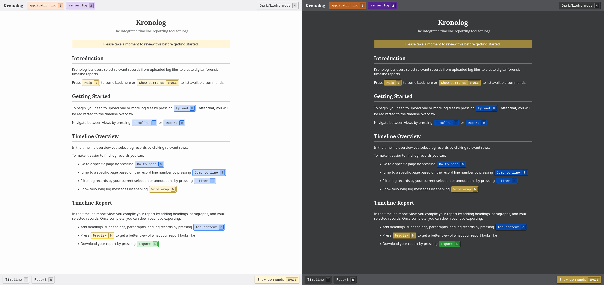
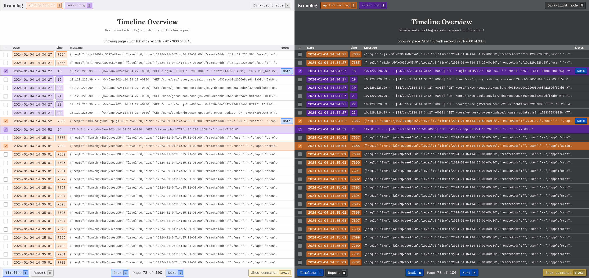
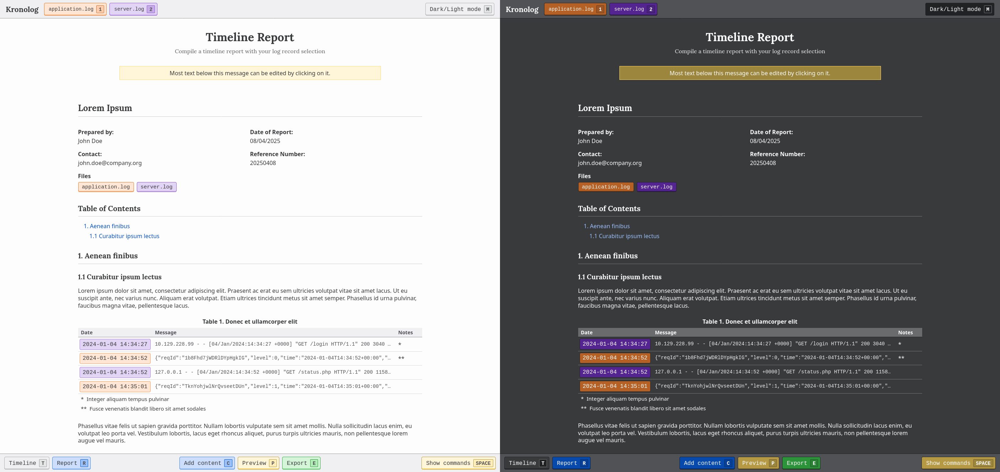

# Kronolog

Kronolog is a browser-based tool for creating timeline reports from log files. It operates entirely client-side, allowing you to compile forensic timeline reports by manually selecting and organizing relevant log entries.

## Features

- **100% Client-Side**: All operations happen in your browser - no data is ever sent to any server
- **Manual Log Selection**: Select specific log entries to include in your timeline report
- **Report Creation**: Compile selected log entries into a structured timeline report
- **Annotation Support**: Add notes to specific log records that appear as footnotes in the report
- **Export Capability**: Export your complete timeline report as a standalone HTML file
- **Supported Log Formats**:
  - JSON
  - Common Log Format (CLF)

## Installation

1. Download the [latest release of Kronolog](https://github.com/trumtomte/kronolog/releases/latest)
2. Extract the file to a location of your choice
3. Open `kronolog.html` in your browser

No additional installation or dependencies required.

## Quick Start

1. Open Kronolog in your browser
2. Upload log files (files remain local and are never sent to any server)
3. Use example logs in the "examples" directory for testing
4. Browse logs in the "Timeline Overview" view to select relevant entries
5. Compile your report in the "Timeline Report" view
6. Export the final report as an HTML file

## Usage Guide

### Timeline Overview

In this view, you can:

- Browse through paginated logs
- Jump to specific lines within log files using "go to page" or "jump to line" functions
- Filter log records based on your selection or annotations
- Add annotations to specific log entries for inclusion in your report

### Timeline Report

In this view, you can:

- Add headings, subheadings, and paragraphs
- Insert selected log records
- Preview your report (hiding application toolbars)
- Export the complete report as a standalone HTML file

## Intended Workflow

Kronolog is designed to be used after you've already performed log analysis:

1. Analyze your logs using other tools or methods
2. Upload the logs to Kronolog
3. Use Kronolog to select and organize the relevant entries you've identified
4. Create a structured timeline report with your selected entries
5. Export the report for inclusion in a more comprehensive forensic document

**Do note** that it is still possible to do rudimentary (manual) log analysis with Kronolog.

## Screenshots

## Customization

Kronolog was developed as part of a research project to facilitate the documentation phase of digital forensic investigations by creating structured timeline reports from log data.

## License

This project is licensed under the GNU General Public License. See the LICENSE file for details.

## Contributing

Contributions are welcome! Please feel free to submit a Pull Request.